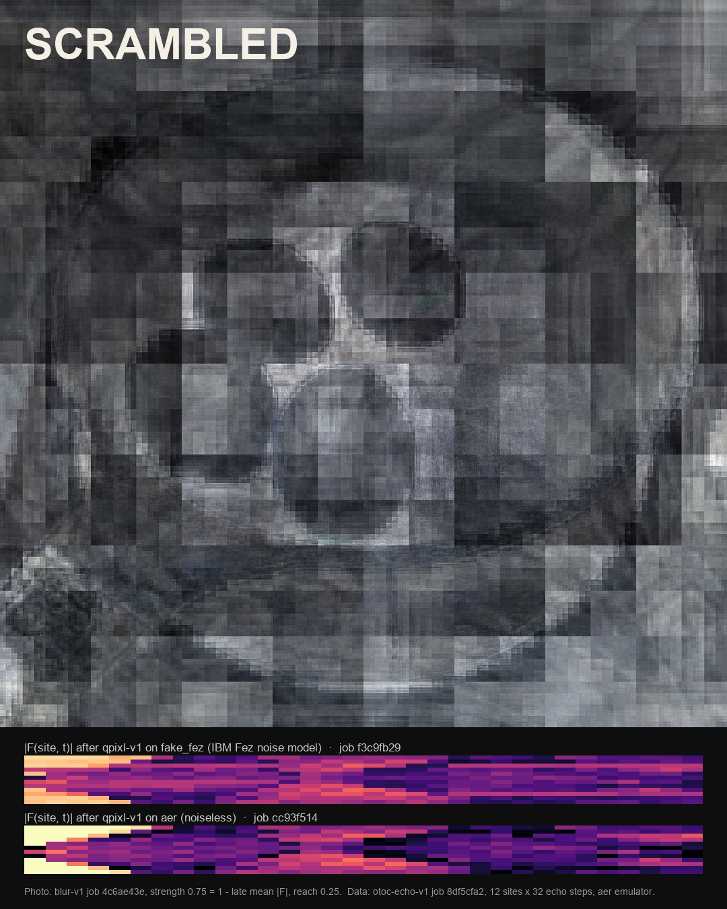

# SCRAMBLED

Quantum information scrambling, measured on [Moth Quantum's Atlas](https://platform.mothquantum.com) and rendered as eggs.

You cannot unscramble an egg. SCRAMBLED measures the quantum version of that fact: nudge one qubit in a chain of twelve, run the circuit forward and backward, and see how much of the nudge comes back at each qubit and step. That map, an out-of-time-order correlator F(site, t) from `otoc-echo-v1`, drives everything in this repo.

**Live:** [scrambled-mu.vercel.app](https://scrambled-mu.vercel.app) has every piece playable in the browser: the film, the track, the notebook and the explorer, where you can run a real Atlas measurement without a key.

Built solo for **Moth Hack 2026** by Mana Blumicz. Everything ran on the Atlas **Qiskit Aer emulator**; compositing, mixing and rendering are classical and labelled as such.



## Entries

| Challenge | Piece | Where |
|---|---|---|
| 04 Moving image | SCRAMBLED, an 88 s film: twelve strips of egg, one per qubit, each cooked by its measured echo | [out/piece/scrambled_piece_v3.mp4](out/piece/scrambled_piece_v3.mp4), [watch on the site](https://scrambled-mu.vercel.app/#pieces) |
| 02 Make it audible | The film's track: cooking audio echoed on Atlas by `retrocausal-echo-v1` through the measured maps, plus a qrc-midi and blur-midi melody | [out/piece/scrambled_track.mp3](out/piece/scrambled_track.mp3), [listen on the site](https://scrambled-mu.vercel.app/#pieces) |
| 07 VST | Scrambled Echo, a VST3 whose echo taps are measured OTOC maps, played through an egg you crack open | [plugin/](plugin/), [download for Windows or macOS](https://github.com/SplendidAfternoon/scrambled/releases/tag/vst) |
| 08 Web app | SCRAMBLED Explorer: set the drive angles and measure a chain live on Atlas from the browser (no key needed), then scrub through time as the eggs scramble strip by strip | [scrambled-mu.vercel.app/explorer.html](https://scrambled-mu.vercel.app/explorer.html), [web/](web/) |
| 10 Quantum-native | Workflow notebook, from probe to film, including a θzz sweep of where scrambling switches on | [notebook/](notebook/), [read it](https://scrambled-mu.vercel.app/notebook.html), [run it in Colab](https://colab.research.google.com/github/SplendidAfternoon/scrambled/blob/main/notebook/scrambled_workflow.ipynb) |

## The measurement

| Setting | What happens |
|---|---|
| Clifford control (θzz = π) | The nudge never spreads: every other qubit returns perfectly, the kicked one flips sign. |
| Scrambling (θx = 0.3π, θzz = 0.35π) | The nudge spreads inside a light cone, reaching both ends by step 6; echoes fade and invert; part returns around step 13–16 because the chain is finite. |

An independent numpy statevector reproduces every Atlas map to ~1e−13, which pins down the circuit (ZZ layer, then Rx, per Floquet step). The clean chain (θz = 0) is free-fermion integrable, so "scrambling" here means operator spreading; adding a z-field (θz = 0.25π, also measured) removes the revival. Full study: [measurements/MEASUREMENTS.md](measurements/MEASUREMENTS.md).

## Repo map

| Folder | What's inside |
|---|---|
| [core/](core/) | The film and track: measurement analysis, image ladders, arrangement, mixing (`piece.py` renders the film) |
| [plugin/](plugin/) | Scrambled Echo VST3 source, tests and build script |
| [notebook/](notebook/) | The workflow notebook (`.ipynb` + rendered `.html`) and the script that builds it |
| [scrambled/](scrambled/) | Python package + CLI: apply a measured map to any image, audio or video ([docs/CLI.md](docs/CLI.md)) |
| [web/](web/) | The live site: explorer and the keyless Atlas proxy |
| [three/](three/) | 3D egg mesh and crack timing (the plugin's egg shell comes from here) |
| [pipeline/](pipeline/) | The first Atlas runs: probes, uploads and the original image and audio renders |
| [extra/](extra/) | Side runs on other engines, including the ones that never completed |
| [hero/](hero/) | Single-image blur-v1 study, used for the poster |
| `moth.py`, `fmap.py` | Shared Atlas client (with the job cache) and the F(site, t) loader |
| `cache/`, `probes/`, `measurements/`, `renders/`, `media/` | Data: cached Atlas jobs, measured maps, rendered assets, source photos and audio |
| `out/` | Finished outputs: the film, the track and stills |

## Engines used

`otoc-echo-v1` · `blur-v1` · `telablur-v1` · `qrc-midi-v1` · `blur-midi-v1` · `blur-core-v1` · `entanglement-shader-v1` · `tamagotchi-v1` · `qpixl-v1` · `qdrive-api-v1` · `retrocausal-echo-v1`

Each has completed jobs whose output is used; [core/ENGINES.md](core/ENGINES.md) is generated from the job cache and lists them all. `tessa-image-v1`, `tomography-api-v2` and `deep-fryer-v1` were attempted and did not complete during the hack (server-side timeouts); they are not credited.

## Run it

Needs Python 3.11+, git and `ffmpeg` on `PATH` (for video and non-WAV audio). Windows:

```powershell
python -m venv .venv
.venv\Scripts\pip install -e ".[test,core]"
.venv\Scripts\pytest -q core tests            # 40+ tests
.venv\Scripts\scrambled --help
.venv\Scripts\scrambled replay --video        # rebuilds the demos from cache/, no key, no network
```

macOS / Linux: the same with `source .venv/bin/activate`, then `pip install -e ".[test,core]"`, `pytest -q core tests` and `scrambled replay --video`.

Every Atlas job is cached by content hash under `cache/`, so the whole project replays offline. To run live, put `MOTH_API_KEY=...` in `.env` and use `--mode atlas`. Web app: see [web/README.md](web/README.md). Plugin build: [plugin/README.md](plugin/README.md).

## Honesty notes

- All quantum runs are on the Aer emulator through Atlas, not quantum hardware.
- The track's echo layer is rendered on Atlas by `retrocausal-echo-v1` from the measured maps (one job per act). The CLI and the VST use a local renderer of the same taps (classical step); per act it tracks the engine render with envelope correlation 0.69 to 0.97.
- Generative AI: Cursor agents wrote most of the code and drafted the docs under my direction. No generative image, audio or video models were used for the media. The photos and cooking footage are mine.

## Licence

MIT, see [LICENSE](LICENSE).
