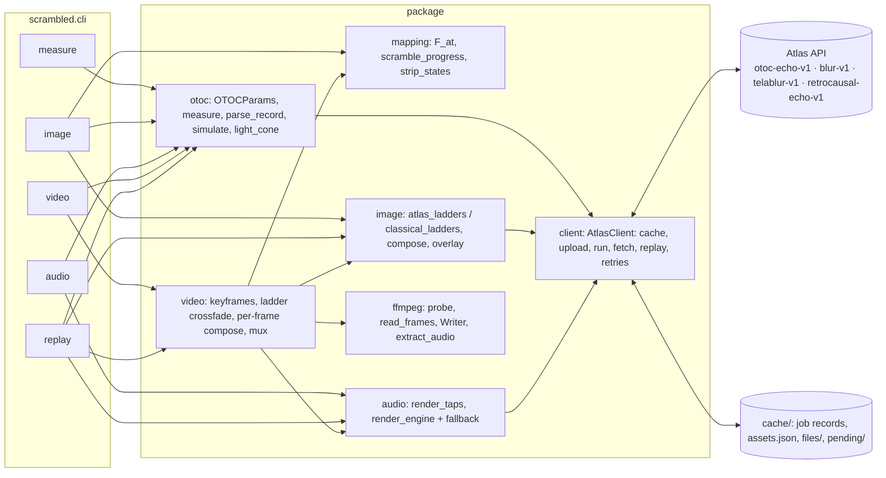
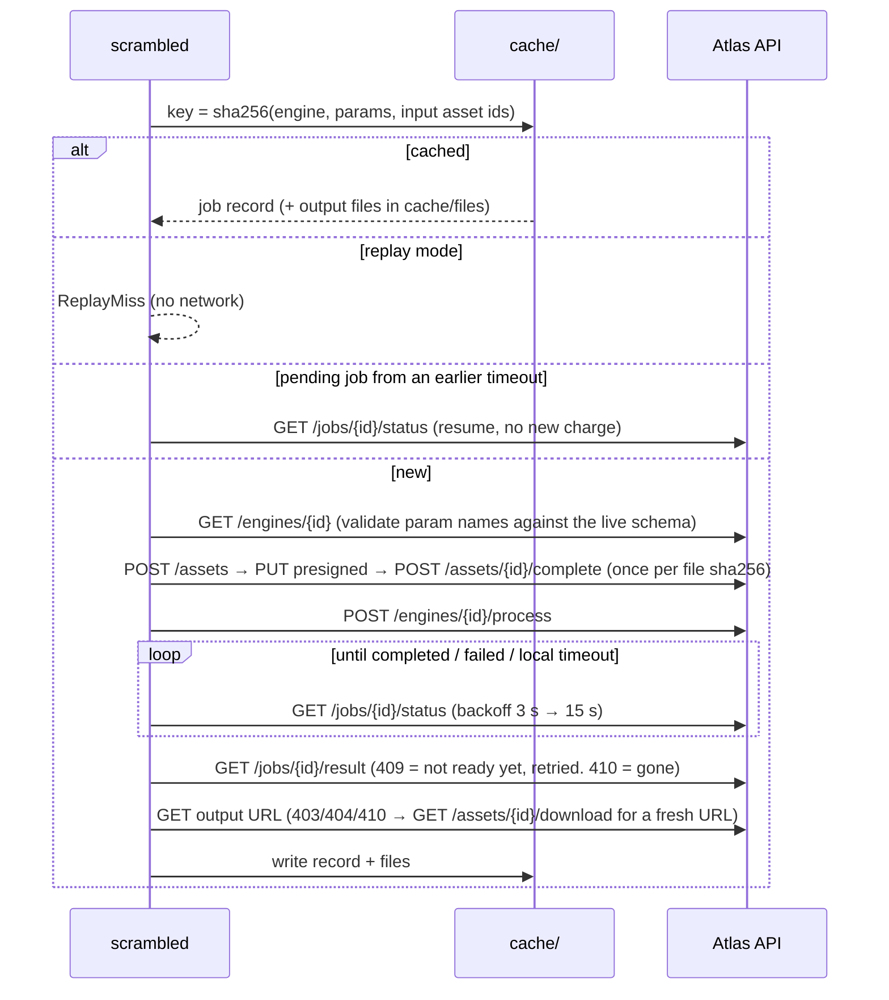

# scrambled: quantum information scrambling, applied to your media

`scrambled` is a Python package and command-line tool. It measures how a quantum circuit scrambles information,
using an out-of-time-order correlator (OTOC) measured on [Moth Quantum's Atlas](https://docs.mothquantum.com)
platform with the `otoc-echo-v1` engine. It then uses that measured map to scramble any **image, audio file or
video** you give it. The picture is cut into one vertical strip per qubit, and each strip blurs, flips and morphs
exactly as far and as fast as the measured "quantum butterfly effect" reaches that qubit. The image renders come
from Atlas's quantum image engines (`blur-v1`, `telablur-v1`). Audio is echoed through the same measured map.

```
scrambled video media/clip_720.mp4 --audio media/stem_full.wav -o out/cli_demo/eggs_scrambled.mp4
```

## Install

Requires Python 3.11+ (tested on 3.14) and `ffmpeg`/`ffprobe` on `PATH` for video and non-WAV audio.

```powershell
python -m venv .venv
.venv\Scripts\python -m pip install -e ".[test]"
.venv\Scripts\scrambled --help
```

For `--mode atlas`, put your Atlas key in `.env` as `MOTH_API_KEY=...` (or export it). The key is only sent as a
Bearer header and is never printed, logged or written to the cache. `--mode replay` and `--mode classical` need no key.

## Modes

| mode | OTOC map F(site, t) | image ladders | network / key |
|---|---|---|---|
| `atlas` (default) | `otoc-echo-v1` job on Atlas (aer emulator by default) | `blur-v1`, `telablur-v1` jobs | yes; every job cached |
| `replay` | from `cache/` only | from `cache/` only | **none**; a cache miss is an error |
| `classical` | exact numpy statevector simulation | Gaussian blur + crossfade | none; output labelled CLASSICAL |

Every output frame carries a provenance label (e.g. `Atlas otoc-echo-v1 (emulator) + blur-v1/telablur-v1`, or
`CLASSICAL MODE: ...`). Every output file also gets a sidecar `<output>.json` recording the mode, the OTOC job id,
every ladder job id and which audio renderer actually ran.

## Commands

All commands accept `--mode`, `--cache-dir`, `--timeout` and `-q`. The media commands also accept the OTOC options
(`--sites 12 --depth 32 --theta-x 0.3pi --theta-zz 0.35pi --kick Z --kick-site N --machine aer --control`) or
`--otoc map.json` to reuse a saved map. Angles take radians or multiples of pi (`0.35pi`). `image` and `video` take
`--layout strips` (default, one vertical strip per qubit) or `--layout rings`, where ring r holds the qubits r steps
from the kicked one, so the scramble spreads outward from the middle of the picture like a ripple.

| command | what it does |
|---|---|
| `scrambled measure [-o out/otoc_map.json]` | Measure F(site, t), save it, and print the light-cone arrival times and the late-time mean \|F\|. |
| `scrambled image IN [--pair B] -o OUT.png\|.mp4` | `.png`: a still at echo step `--at` (default: last). `.mp4`: animate t = 1..T over `--seconds`. `--pair` is the morph target (same framing, e.g. the "after" photo). |
| `scrambled audio IN -o OUT.wav [--engine]` | Multi-tap echo of IN through the OTOC map. `--engine` tries Atlas `retrocausal-echo-v1` first and falls back to the local render on failure or timeout. |
| `scrambled video IN -o OUT.mp4` | Per-frame strips driven by F over time. Quantum ladders on `--keyframes K` frames, crossfaded in time. The soundtrack (the video's own, or `--audio FILE`) keeps its dry signal and gains the OTOC echo. `--pair last` (default: final frame of the excerpt), `none` (non-local quantum blur), or an image. `--start/--duration` cut an excerpt. |
| `scrambled replay [--video] [-o out/replay]` | Rebuild the demo (both OTOC maps, the egg animations, both echoes and, with `--video`, the 58 s cooking video) from the committed cache. No key, no network, no credits. |

`--control` sets theta_zz = pi, which makes the circuit Clifford (it cannot scramble). This is the baseline: F stays
at exactly +1 everywhere except the kicked qubit, where it is exactly -1.

## What the strips mean

`otoc-echo-v1` prepares 12 qubits in |+>. For each echo depth t it runs t Floquet steps
U = Rx(theta_x)^n · exp(-i theta_zz/2 · sum Z_i Z_{i+1}), applies a Pauli Z "kick" to the centre qubit, runs the
steps backwards, and measures <X_i> + i<Y_i> on every qubit (normalised by the un-kicked run). That is the OTOC
F(i, t).

* **|F| = echo memory**: 1 means qubit i cannot tell the kick happened, so its strip stays sharp. Lower |F|
  blurs the strip along the quantum blur ladder (`blur-v1`, where reach grows with strength).
* **Re F < 0 = polarity**: the qubit sees the kick as a flip, so its strip is shown upside down.
* **Scramble progress** = gain × ∫(1 − |F|) dt (cumulative, per strip). Past a threshold the strip morphs along the
  `telablur-v1` ladder toward the pair image: an unreadable quantum texture in the middle, the target at 0.98.
* **Light cone**: in the measured run the kick reaches one more qubit per echo step on each side
  (arrival t = 6,5,4,3,2,1,1,1,2,3,4,5). Outside it F = 1 exactly, so those strips play the untouched media.
  With `--layout rings` the same cone is a disc that grows from the centre; a ring holding two qubits averages them,
  and a flipped ring is turned half a turn, which keeps it on itself.
* **Finite-size revival**: on 12 qubits |F| partly recovers around t ≈ 13–16 (strips briefly re-sharpen) before
  decaying again. This is a real feature of a small system, not a rendering artefact.

Between integer echo steps |F| is interpolated linearly and the phase is taken from the nearer step. That way a clean
+1 → −1 flip never passes through F = 0, which would fake a loss of memory that was never measured.

## Architecture



## API flow



Requests that hit 429 or 5xx are retried with exponential backoff, honouring `Retry-After`. A job that outlives
`--timeout` is saved under `cache/pending/`; the next identical call resumes polling that job, so it is paid for
once. A failed ladder rung is skipped with a warning (the ladder just gets coarser); if a whole ladder
fails, the command exits with an error that suggests `--mode classical`.

## Cost model (Atlas credits)

| run | jobs | credits |
|---|---|---|
| `measure` (`otoc-echo-v1`) | 1 | 1 (0 if cached) |
| `image --pair` | 4 `blur-v1` + 4 `telablur-v1` | 8 |
| `image` (no pair) | 4 + 3 `blur-v1` | 7 |
| `video --keyframes K` | K × (3 `blur-v1` + 3 `telablur-v1` or `blur-v1`) | 6K (default K = 4 → 24) |
| `audio --engine` | 1 `retrocausal-echo-v1` (+ upload) | 2 |
| any re-run, `replay`, `classical` | 0 | 0 |

Per-frame quantum rendering would cost one job per rung per frame (≈ 10,000 jobs for the 58 s clip). Keyframes
keep the cost bounded and independent of video length. Level 0 of every blur ladder is the live frame, so strips
outside the light cone always show the real video.

## Demo outputs (produced by this package)

| file | how |
|---|---|
| `out/cli_demo/eggs_scrambled.mp4` | `scrambled video media/clip_720.mp4 --audio media/stem_full.wav --keyframes 4 -o ...` (atlas; 58 s, 406×720, 24 ladder jobs; OTOC job `8df5cfa2-e57c-43a8-a93a-63975efd252c`) |
| `out/cli_demo/eggs_image.mp4` | `scrambled image media/prep/A_sq.jpg --pair media/prep/B_sq.jpg -o ...` (atlas; all 8 ladder jobs were cache hits) |
| `out/cli_demo/eggs_rings.mp4` | `scrambled image media/prep/A_sq.jpg --pair media/prep/B_sq.jpg --layout rings --theta-x 0.1pi --mode replay -o ...` (the gentle drive, OTOC job `6e5e76ef`: a ring of scrambled egg opens from the centre of the pan; no key, all jobs from the cache) |
| `out/cli_demo/life_scrambled.mp4` | a procedurally generated Game of Life video with a synth melody (`sample_life.mp4`, made with ffmpeg's `life` and `aevalsrc` sources), run with `--keyframes 3 --pair none`. This shows the tool works on media that has nothing to do with eggs and needs no pair image. |
| `out/cli_demo/*_contact.jpg` | contact sheets of the videos |
| `out/cli_demo/replay/` | `scrambled replay --video` with `MOTH_API_KEY` empty and no network |

Each `.mp4` has a `.mp4.json` provenance sidecar listing every Atlas job id used.

## Tests

```powershell
.venv\Scripts\python -m pytest -q
```

32 tests, about 12 s. They cover:

* F parsing of `probes/otoc_*.json`, and that the engine's own `light_cone` matches the one computed from F.
* The classical simulator reproduces both Atlas measurements (scrambling and Clifford control) to 1e-9, and
  refuses conventions it has not verified (`theta_z`, `disorder`).
* Mapping invariants: the control run flips only the kick strip with zero blur or morph; |F| = 1 is always sharp;
  scramble progress is monotone and bounded.
* Cache keying matches the records already in the repo, so the original scripts and the package share one cache.
* Client behaviour without a network: replay with no key, a clear error on a replay miss, a timed-out job is
  resumed on the next call, unknown params are rejected before submitting, 429 retry, and expired output
  URLs are re-signed.
* CLI smoke tests on tiny generated image, audio and video inputs in classical mode, plus `replay` with the network
  blocked.

## Honesty notes

* **Emulator, not hardware.** The measurements used here ran on Atlas with `machine: aer`, an exact noiseless
  emulator. `--machine <ibm_backend>` is passed through to the engine but has not been exercised by this project.
* **What is quantum and what is classical.** F(site, t) comes from `otoc-echo-v1`. The blur and morph renders come
  from `blur-v1`/`telablur-v1`, which are quantum image-encoding circuits run by Atlas. Cutting strips, crossfading
  between ladder rungs and keyframes, the heatmap overlay, video encoding and the default audio echo (a numpy
  convolution of the measured taps) are **classical** steps on your machine.
* **Audio.** `retrocausal-echo-v1` was unreliable during development: test job
  `6dabddfc-5ba3-4281-be12-c1d8e1303b72` failed server-side with `engine_timeout`. The demo soundtracks therefore
  use the local tap render, and their sidecars say so.
* **Classical mode** uses an exact statevector simulation that matches the emulator to 1e-9 on the default
  parameters. A 12-qubit chain is small enough to simulate classically; the point of Atlas here is the
  measured-on-the-platform provenance and the quantum image engines, not a speed-up. Outputs made in classical mode
  are labelled so they can never pass as quantum.
* **Physics wording.** "Fully scrambled" in the visuals is an artistic end state (the morph target). The measured
  late-time mean |F| over the non-kicked qubits (t = 17–32) is 0.25 on 12 qubits, against exactly 1.0 for the
  Clifford control. A finite chain never scrambles completely and shows revivals.
