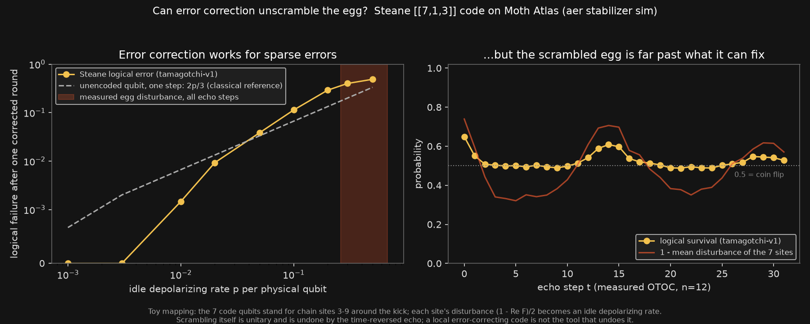
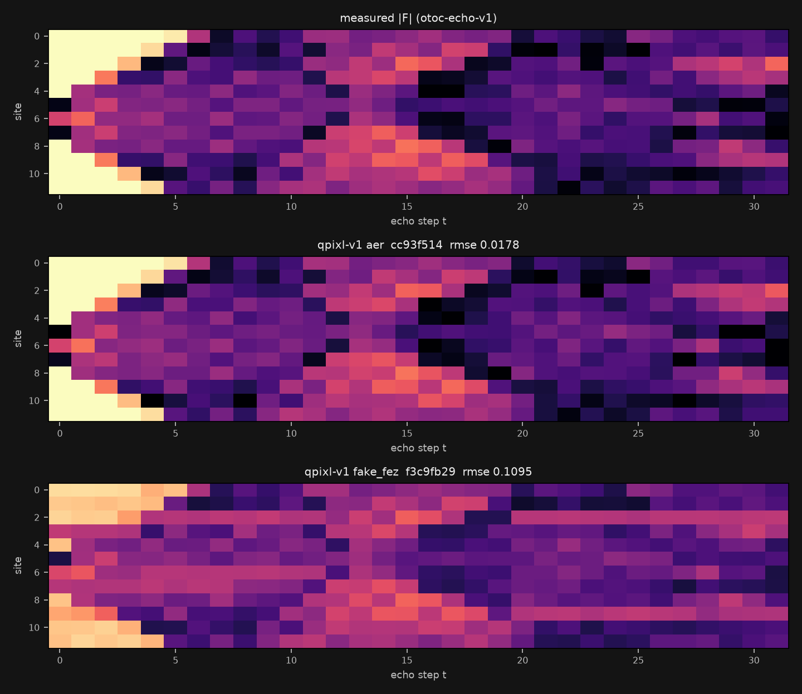
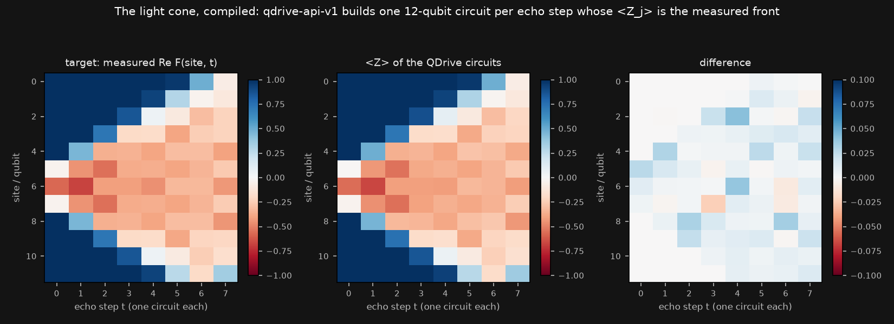

# Extra engines (Daisy Chain additions)

This adds three engines to the seven already credited in `core/ENGINES.md`. Each one has a defined job in SCRAMBLED, and its output is used in a figure or in the poster. Three more engines were tried this session and did not complete. They are listed under "Attempted" and are not credited. Every quantum step ran on Moth Atlas emulators (aer, or the fake_fez noise model where stated). Plotting, compositing and the per-qubit ⟨Z⟩ check are classical.

All inputs come from the measured n = 12 OTOC in `probes/otoc_scrambling.json` (`otoc-echo-v1` job `8df5cfa2`: kicked Ising chain, θx = 0.3π, θzz = 0.35π, depth 32, aer, exact).

| engine | status | role | output | credits |
|---|---|---|---|---|
| `tamagotchi-v1` | **used** | Steane-code test: can error correction undo the scrambling? | `extra/tamagotchi/qec_card.png` | 0 |
| `qpixl-v1` | **used** | quantum image encoding of the measured \|F\| map, used as the poster's data band | `extra/qpixl/qpixl_compare.png`, `extra/poster/scrambled_poster.png` | 2 (+1 rejected) |
| `qdrive-api-v1` | **used** | one 12-qubit circuit per echo step whose ⟨Z_j⟩ is the measured front | `extra/qdrive/front_circuits.png`, `extra/qdrive/out/*.brf` (QASM 3) | 8 |
| `deep-fryer-v1` | attempted, not completed | photo B (scrambled eggs) with the run's gate angles | none | 2 jobs still queued |
| `tessa-image-v1` | attempted, failed | 64 × 64 crop of photo A | none | 1 job, `engine_timeout` |
| `retrocausal-echo-v1` | attempted, not completed | 6-site impulse response | none | 1 job still processing |

Reproduce everything from cache with no credits by setting `$env:MODE='replay'` and running each `run.py`. Checks: `.venv\Scripts\python -m pytest -q extra\test_extra.py`.

## tamagotchi-v1: can error correction unscramble the egg?

`extra/tamagotchi/run.py` → `qec_card.png`, `results.json`



The engine simulates a Steane [[7,1,3]] logical qubit. It runs one noisy syndrome-extraction round with correction (`actions [["I",0],["SE",0]]`, 4096 shots, seed 7, stabilizer method) and reports how often the logical state survives.

- **Reference sweep.** The idle depolarizing rate p_idle runs from 0.001 to 0.5 (9 jobs). At p ≤ 0.003 the code recovers every shot. At p = 0.01 its failure rate (0.0015) is below the 2p/3 = 0.0067 of an unencoded qubit after one depolarizing step. That 2p/3 line is a classical reference, not an engine result. From p = 0.05 up, the encoded qubit does worse than that reference, and at p = 0.5 survival is 0.51, a coin flip.
- **The egg (32 jobs, one per echo step).** This uses a toy mapping. The 7 code qubits stand in for chain sites 3–9 around the kick (site 6). Each site's disturbance is d = (1 − Re F)/2. That is the squared commutator C = 2(1 − Re F) as a fraction of its maximum value of 4. The mean d over the 7 sites becomes p_idle. The measured d ranges from 0.26 to 0.68. That is far above the region where the code helps. Logical survival is 0.65 at t = 0, falls to a coin flip (≈ 0.50) by t = 2, and recovers slightly to 0.61 at the finite-size revival (t = 14).
- **Reading.** A local error-correcting code fixes sparse, independent errors. Scrambling spreads the kick across the whole block, and that is not the kind of error such a code can remove. Scrambling is unitary, and it is undone by the time-reversed echo that the OTOC measurement performs, not by QEC. The Clifford control (θzz = π) would leave a single weight-1 Pauli on the kick site, which Steane corrects by construction. The engine's uniform noise model cannot inject that one targeted error, so the control is not run here.
- Job ids, sweep (p: job): 0.001 `9ac75925`, 0.003 `a23995aa`, 0.01 `f73b767c`, 0.02 `9b04d228`, 0.05 `f07c489d`, 0.1 `31278c12`, 0.2 `76cd002f`, 0.3 `20748dbc`, 0.5 `ec053744`.
- Job ids, echo steps t = 0…31: `9458bb60` `b410925e` `2e58a40c` `c1391bff` `9bce1afc` `be6c4458` `ab06ffec` `83787354` `eec40e67` `8e5eddfe` `1a1a29bd` `577dcfda` `a1ef8e1e` `99e3894d` `fb33b018` `d1dc8d74` `f5e24f6f` `809f8d89` `66feffab` `9e627450` `9d9c0ab8` `6d049a45` `e899afd3` `ed261ba6` `4cf06d62` `256806b7` `a2064bf3` `41e9800d` `76ccdffa` `790aad1f` `4ce58752` `255590fe` (full ids in `results.json`).
- Six probe jobs were used to learn the engine's semantics (noise acts only during `SE`, and `X` is a logical gate). They are in the cache but not in the figure: `f853adc2`, `98ecd8ce`, `c5e35cc6`, `50dac610`, `afcb9776`, `d1b9757f`.

## qpixl-v1: the scrambling map, quantum-encoded

`extra/qpixl/run.py` → `qpixl_compare.png`, `texture_*.png`, `decoded_*.npy`, `raw_*.json`, `results.json`



The 12 × 32 grid of |F(site, t)| (384 values in [0, 1], site-major) goes through Interwoven QPIXL encoding and is decoded from 4096 shots per data-qubit group. Parameters: `discretize 0`, `dynamic_range none`, `mode emu`.

| machine | job | wall s | RMSE vs measured | correlation |
|---|---|---|---|---|
| `aer` (noiseless) | `cc93f514-a4a4-49e9-b63c-d3313ac91427` | 13.6 | 0.018 | 0.997 |
| `fake_fez` (IBM Fez noise model) | `f3c9fb29-3e09-4085-a5b0-cdda9bfea315` | 210.6 | 0.110 | 0.916 |

The light cone, the scrambled plateau and the revival around t ≈ 15 all survive the noisy round trip. The noise compresses the contrast toward the middle of the range and washes out the darkest cells. Both decoded grids are the two data bands of `extra/poster/scrambled_poster.png`. A first attempt on `fake_torino` (job `0a3945c1-b388-48a4-8958-edf4229b2b9a`) was rejected before running: `insufficient_qubits`, 384 values exceed Torino's capacity of 378.

## qdrive-api-v1: the light cone, compiled

`extra/qdrive/run.py` → `front_circuits.png`, `out/*.brf` (OpenQASM 3 text, the engine's file name), `results.json`



For each echo step t = 0…7 (the cone crosses the chain in about 6 steps), QDrive receives 12 single-qubit targets ⟨Z_j⟩ = Re F(j, t). It returns a circuit that prepares them (`update_method spectral`, 4096 shots, seed 12, aer, `tomography 1`). Single-qubit targets only need a product state, and each circuit is rz·ry·rz per qubit with no entangling gates. This encodes the measured front into 8 circuits. It does not re-run the echo dynamics. The achieved ⟨Z_j⟩ = cos(ry_j) is computed classically from the QASM and matches the targets to within 0.042 at every step (max |ΔZ| per step: 0.027, 0.030, 0.032, 0.023, 0.042, 0.027, 0.034, 0.023). The inline `result` was `null` despite `tomography 1`, so the check is the classical one.

| t | job |
|---|---|
| 0 | `dd643f35-37d5-43b9-9993-db3cccba5831` |
| 1 | `2be8d26f-0d23-4b1c-9b58-3fbfe652de57` |
| 2 | `0bee98b5-1c7f-4e7e-8c70-79561d7321ed` |
| 3 | `787043c0-8996-4cd1-a8f7-fe73a6140f78` |
| 4 | `fdd5b682-97cc-4a91-91ef-5b406e5cd088` |
| 5 | `37c820de-59ff-47f4-a280-c15410102a13` |
| 6 | `46c010e7-45fb-4fb0-ab5b-e0069d2efc0e` |
| 7 | `002c7928-ad78-4cd7-ae5c-d02c5f55cba2` |

## Poster (new small artefact)

`extra/poster/make.py` → `scrambled_poster.png` / `.jpg` (1080 × 1350). Classical compositing of engine outputs: the Challenge 01 hero image (`hero/hero.png`, blur-v1 job `4c6ae43e`) above the two qpixl-v1 round trips of the measured map.

## Attempted (not credited)

- **deep-fryer-v1.** Photo B (`extra/deep_fryer/input_B_sq.png`) with gates `[["rx",0.3],["rz",0.35]]`, the run's θx/π and θzz/π, plus the engine default `[["rx",0.5]]`, tile_size 4. Jobs `3d15bd3e-baf1-4d96-94ea-a9e603b26963` (submitted 21:16 UTC) and `ee750888-addb-4502-b139-d3a3e3b0a55d` (21:31 UTC) were still `queued` with no progress when last checked. `extra/pending.py` polls them and downloads any result to `extra/deep_fryer/late/`. Re-running `run.py` would submit new jobs, because jobs that timed out locally are not in the cache.
- **tessa-image-v1.** A 64 × 64 crop of photo A, aer. Job `5d872bb7-4eb8-433b-81c1-68eae42357b0` failed immediately with `engine_timeout` ("The engine did not respond in time"). Same failure mode as before.
- **retrocausal-echo-v1.** A minimal run (6 sites, depth 8, no audio, so the engine would emit its own impulse response). Job `ead5c974-4171-4a11-8d10-898be01c0688` was still `processing` after the 600 s local wait. The earlier jobs `721c5d5d-6400-431d-b21c-4b5f84d1c7bc` (submitted 19:28 UTC, "running on aer") and `e3e80d2b-9d0f-4aed-a40e-e35bb37485e1` (19:30 UTC, "Building the tap map") were also still `processing` at about 21:35 UTC.

Run `.venv\Scripts\python extra\pending.py` to refresh these statuses (GET only). Completed outputs land in `extra/<engine>/late/`.

## Census additions

`core/engines_census.py` currently prints "(used by another part of the project)" for the three new engines. Proposed `ROLE` entries:

```python
    "tamagotchi-v1": ("Steane [[7,1,3]] QEC test: the measured OTOC disturbance of the 7 sites around the kick "
                      "as an idle error rate; error correction cannot undo the scrambling (toy mapping).",
                      "extra/tamagotchi/qec_card.png, extra/tamagotchi/results.json"),
    "qpixl-v1": ("QPIXL quantum encoding of the measured |F(site, t)| map (aer and fake_fez noise model): "
                 "the poster's data band.",
                 "extra/qpixl/qpixl_compare.png, extra/poster/scrambled_poster.png"),
    "qdrive-api-v1": ("Compiles the measured scrambling front Re F(site, t), t = 0..7, into one 12-qubit "
                      "circuit per step (product state, <Z> within 0.042 of target).",
                      "extra/qdrive/front_circuits.png, extra/qdrive/out/"),
```

Also proposed:

- `blur-v1` role text: append "; Challenge 01 hero (strength = 1 - late mean |F|)". Evidence: append `hero/params.json, hero/ladder/index.json`. The 12 hero ladder jobs are now in the blur-v1 count (63 → 75).
- `tamagotchi-v1` job count: the census counts 47 cache records. 41 are in the figure and 6 are semantic probes. Either keep 47 or say "41 used + 6 probes".
- The `tessa-image-v1` ROLE text ("game sprite states") is wrong if a Tessa job ever completes. Tessa has no completed job, so it does not appear today. Change the text to "attempted; engine_timeout" or drop the entry.
