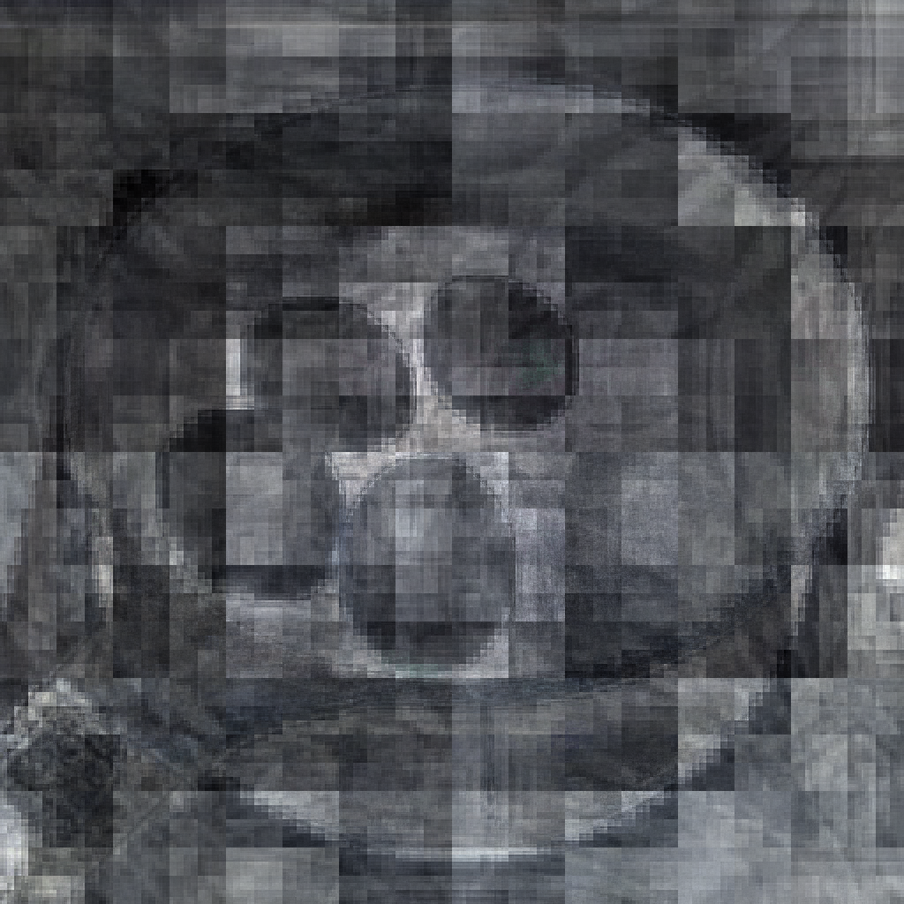

# Challenge 01: one image, one engine



- **Engine:** `blur-v1` (Quantum Blur, v1.1.9), 1 credit
- **Job:** `4c6ae43e-afef-4d62-a54e-8b87076c1fad` (22.5 s)
- **Input:** `hero/input_A_sq.png`, photo A (four whole eggs in a pan), 1024 × 1024. It is a lossless PNG copy of `media/prep/A_sq.jpg`, so the engine returns a PNG.
- **Output:** `hero/hero.png`, 1024 × 1024 PNG. This is the engine's result file, unedited. 1024 is the largest `size` blur-v1 accepts.
- **Full parameters** (every field in the live `GET /engines/blur-v1` schema; four of them are defaults):

| param | value | sent or default |
|---|---|---|
| `strength` | 0.75 | sent |
| `reach` | 0.25 | sent |
| `style` | `rx` | sent |
| `size` | 1024 | default |
| `downscale` | true | default |
| `mask_bin_size` | 4 | default (no mask) |
| `mask_min_region` | 16 | default (no mask) |

`params.json` has the same values in machine-readable form, plus the input hash and asset id. `blur-v1_schema.json` is a snapshot of the engine schema they were checked against.

## Rationale

The strength comes from the project's own measurement. The n = 12 OTOC from `otoc-echo-v1` (job `8df5cfa2`: kicked Ising chain, θx = 0.3π, θzz = 0.35π, aer emulator, exact) has a late-time mean |F| of 0.251 over steps t ≥ 16. In other words, once the kick has scrambled, about three quarters of the echo is gone. The strength is set to 1 − 0.251 ≈ 0.75. blur-v1's `reach` controls how far a pixel's information can travel, from local (0) to anywhere on the canvas (1). It is the image counterpart of the kick spreading along the chain. A 12-run ladder at that strength (`ladder_contact.jpg`) shows the eggs breaking up into blocks above reach 0.25. From reach 0.35 up they are no longer recognisable. Reach 0.25 is the last setting where you can still see the four eggs and the rim of the pan. In this image the eggs have turned dark, almost like a photographic negative, and the frame breaks into the block grid of the qubit encoding. The eggs are halfway between whole and scrambled. Every `ry` run at strength 0.75 came back as a black frame, so the hero uses `rx`. The quantum step runs on Moth Atlas through blur-v1's own circuit simulation. No classical post-processing was applied to the image.

## Ladder

All 12 runs used the same input asset (`hero/ladder/index.json` lists every job id and output file):

| strength | reach | style | job | reads as eggs? |
|---|---|---|---|---|
| 0.75 | 0.15 | rx | `c574395e` | yes, clearly |
| **0.75** | **0.25** | **rx** | **`4c6ae43e`** | **yes, dissolving (chosen)** |
| 0.75 | 0.35 | rx | `5e695932` | barely |
| 0.75 | 0.5 | rx | `d2a4bfe1` | no |
| 0.75 | 0.8 | rx | `e2046ad5` | no |
| 0.75 | 1.0 | rx | `a1b30ea5` | no |
| 0.6 | 0.8 | rx | `8e0c4b50` | no |
| 0.9 | 0.8 | rx | `f8c29395` | no |
| 0.75 | 0.25 / 0.5 / 0.8 / 1.0 | ry | `0449ba35` / `d8d10053` / `9e1cf520` / `13effd33` | black frame |

## Reproduce

```powershell
$env:MODE = 'replay'   # cache only, no credits
.venv\Scripts\python hero\ladder.py
.venv\Scripts\python hero\export.py
```

Without `MODE=replay`, `ladder.py` submits any rungs that are not cached, and `export.py` refreshes the schema snapshot from the API.
