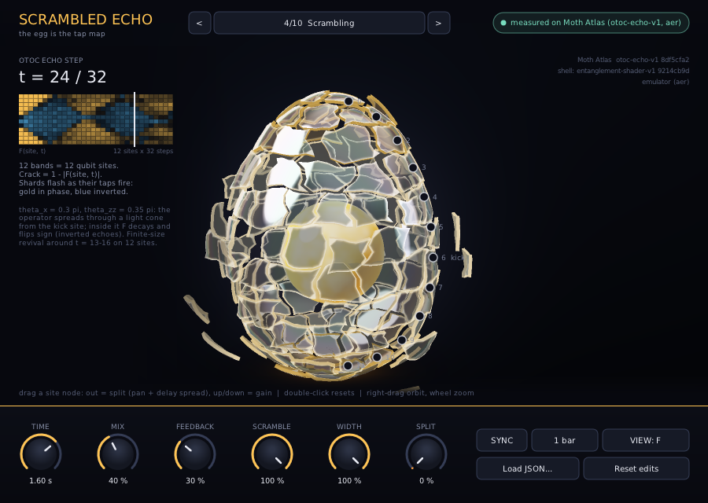
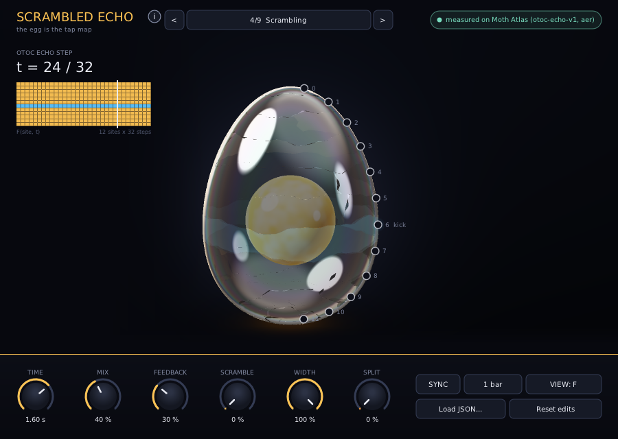
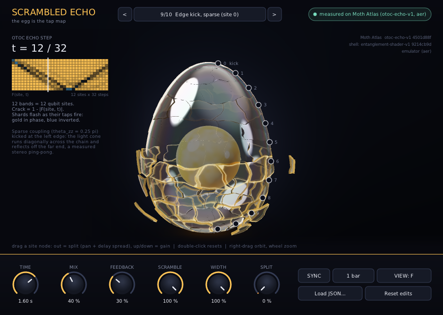
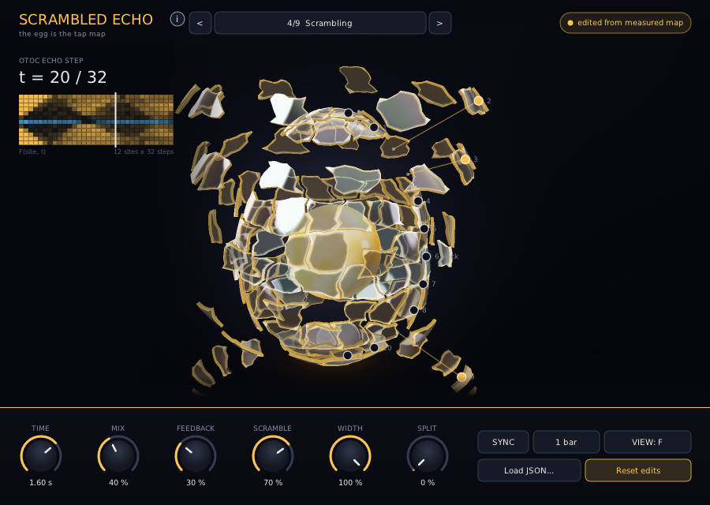

# Scrambled Echo (VST3, Windows x64 and macOS)

A multi-tap delay whose echo pattern is a quantum measurement, edited on a real-time 3D egg. Each tap is one
cell of an out-of-time-order correlator map **F(site, t)** measured on Moth Atlas with the `otoc-echo-v1`
engine (aer emulator, exact expectation values). The plugin plays that map back as echoes, and its editor
shows the map as an egg that cracks where the echo has scrambled:

| map quantity | becomes (audio) | becomes (egg) |
|---|---|---|
| echo step `t = 1..depth` | delay `t / depth × Time` (`t = depth` lands on Time) | the time cursor sweeping after each hit |
| `site / (n_sites - 1)` | constant-power stereo pan, left to right | latitude band, site 0 at the pointed top |
| `\|F(site, t)\|` | echo level | how intact the band is: crack = `1 − \|F\|` |
| sign of `Re F` | polarity (`F < 0` = inverted echo) | gold (in phase) / blue (inverted) tint |
| whole map | wet normalised by `1 / sqrt(Σ gain²)` | — |



Demo with sound: [`docs/ui_demo.mp4`](docs/ui_demo.mp4) (18 s; frames rendered by the editor itself, audio
rendered through the plugin binary with the same automation).

Downloads for both platforms: [releases/tag/vst](https://github.com/SplendidAfternoon/scrambled/releases/tag/vst).

## Install in Ableton Live (Windows)

1. Unzip `dist/ScrambledEcho-2.0.0-win64-vst3.zip` (or use the folder `plugin/dist` directly). It contains the
   bundle `ScrambledEcho.vst3`; keep the whole folder.
2. Live → **Options → Preferences → Plug-Ins**: switch **Use VST3 Plug-In Custom Folder** on, click **Browse**
   and pick `…\moth-hack\plugin\dist` (the folder that *contains* `ScrambledEcho.vst3`).
   Alternatively copy `ScrambledEcho.vst3` into `C:\Program Files\Common Files\VST3\` and use the system folder.
3. Click **Rescan** (hold Alt while clicking for a full rescan if an older 1.0 build was scanned before).
4. Browser → **Plug-Ins → VST3 → Moth Hack 2026 → Scrambled Echo**; drop it on an audio track (stereo effect,
   category Fx | Delay). Click the wrench icon to open the egg.

Everything is statically linked; nothing else needs installing. The editor needs OpenGL 2.1 (any GPU or
integrated graphics from the last decade). Edits, map choice and camera are saved with the Live set; every
egg drag is also an automatable parameter (see below), so you can record the drags as automation.

## Install on macOS

Unzip `ScrambledEcho-macos-universal-vst3.zip` from the release (Intel and Apple Silicon, macOS 10.15+), copy `ScrambledEcho.vst3` into `~/Library/Audio/Plug-Ins/VST3/`, then clear the download quarantine once, because the build is ad-hoc signed and not notarised:

```
xattr -dr com.apple.quarantine ~/Library/Audio/Plug-Ins/VST3/ScrambledEcho.vst3
```

In Live, enable **Use VST3 Plug-In System Folders** and rescan. The macOS build comes from [`mac/Makefile`](mac/Makefile) via GitHub Actions ([workflow](../.github/workflows/vst.yml)).

## The egg editor



**The egg is the map.** A Hügelschäffer egg (the same profile as `three/egg_mesh.py`) is cut into 12 latitude
bands, one per qubit site, with the kick site 6 just below the equator; every band is broken into shell shards
along wandering crack lines. The yolk sits inside.

- **Cracks from data.** Each band opens by `1 − |F(site, t)|` of the map you are hearing: the current Map
  blended with the Control map by Scramble. Scramble 0 % is the Clifford control, `|F| = 1` everywhere, so the
  egg is whole (the kick site keeps a faint blue tint because its F is −1). Scramble 100 % shatters it exactly
  as measured. Off-centre kicks show the light cone: below, the edge kick at t = 12 has cracked only the bands
  the operator has reached.
- **Time cursor.** The plugin's DSP watches the input for onsets. After each hit the cursor (`t = …/32`, and
  the white line in the small F(site, t) map) sweeps the echo steps in step with the echo Time, so the cracks
  run across the shell as the taps play; with Feedback it replays with the regenerated train. Shards flash as
  their taps fire, gold for in-phase taps and blue for inverted ones, and the yolk and floor glow with overall
  activity. With no audio the cursor rests near the end of the train and breathes slowly.
- **Shell.** Iridescence comes from the Entanglement Shader's own reflectance/transmittance tables
  (`three/engine_outputs/shader_9214cb9d/R_lut.hdr`, `T_lut.hdr`, Moth Atlas `entanglement-shader-v1`, job
  `9214cb9d-e1ab-413d-80c1-2bd4c00c2f20`), baked by `tools/export_lut.py` and evaluated with the same thin-film
  lookup as the engine's GLSL (500 nm, λ = 650/530/470 nm). Lighting, crack glow, yolk and floor are classical
  shading written for this editor (ported from `three/web/main.js`).



### Drag to split



Every band has a **grab node** on the egg's right-hand silhouette (labelled with its site number).

| gesture | effect |
|---|---|
| drag a node **outward** (right) | splits that band's shards away from the shell. Audio: that site's taps move toward their stereo edge (up to 75 % of the way) and their delays stretch (up to +50 % for edge sites, +12.5 % for the centre), spreading the echo in space and time |
| drag a node **up / down** | site gain, +6 dB at the top to −24 dB at the bottom; the shards rise or sink with it |
| **Shift** while dragging | fine adjustment |
| **double-click** a node | heals that site (split 0, gain 0 dB) |
| **right-drag** or left-drag on empty space | orbit the camera; horizontal two-finger swipe also orbits |
| **mouse wheel** / two-finger vertical | zoom; Ctrl + wheel tilts |
| double-click empty space | reset the camera |
| **Reset edits** | heals every site and sets Split to 0 |

Edits glide with a 30 ms smoother inside the DSP (no zipper noise; the delay stretch bends pitch slightly while
it moves, like tape). The DSP is otherwise unchanged: the makeup gain still follows the measured map, so a
boosted site is really louder, and feedback normalisation includes the site gains so loop gain still never
exceeds the Feedback knob.

### Honesty label

The header shows **measured on Moth Atlas (otoc-echo-v1, aer)** while every node sits on its measured
position. As soon as any site is split or its gain changed, or the Split macro is above 0, it switches to
**edited from measured map** (custom JSON maps say *custom map* / *edited from custom map* instead). Scramble
does not count as an edit: it blends two measured maps.

## Controls

The strip under the egg keeps the original controls.

| control | range | what it does |
|---|---|---|
| **Map** | 9 measured maps + Custom JSON | `<` / `>` or click the name in the header to step |
| **Scramble** | 0–100 % | interpolates F cell by cell from the **Control (Clifford)** map at 0 % to the selected map at 100 % |
| **View** | F / C | **F**: gain = signed \|F\| (the echo that survives). **C**: gain = `(1 − Re F) / 2`, the normalised squared commutator, loud only where the kicked operator has spread: the light cone itself. The egg always cracks by `1 − \|F\|` |
| **Time** | 50 ms – 8 s | length of the whole echo train. Smoothed, so sweeping it bends pitch rather than clicking |
| **Sync** + **Division** | 1/4, 1/2, 1 bar, 2 bars, 4 bars | locks the train length to host tempo (4/4); 120 BPM if the host sends none. With Sync on, the Time knob selects the division |
| **Mix** | 0–100 % | dry/wet |
| **Feedback** | 0–95 % | re-injects the final echo step (`t = depth`) so the whole train replays. Loop gain is normalised by that column's summed \|gain\| (including site gains), so it never exceeds the knob value |
| **Width** | 0–100 % | scales the site → pan spread (0 % = mono; split sites still move outward) |
| **Split** | 0–100 % | macro added to every site's split: the whole egg comes apart |
| **Load JSON…** | file | loads a custom map and selects Custom JSON |
| **Site N split** (×12) | 0–100 % | automatable parameter behind each node's outward drag |
| **Site N gain** (×12) | −24…+6 dB | automatable parameter behind each node's vertical drag |

Knobs: drag vertically (Shift = fine) or use the mouse wheel. The window is resizable (default 900 × 640,
minimum 720 × 520) and scales with Windows display scaling.

## Where the taps come from

`otoc-echo-v1` runs a kicked Floquet chain forward for `t` layers (RX(θx), RZZ(θzz), optional RZ(θz)), applies a
Pauli kick on one site, runs it backward, and returns `F(site, t)` for every site and every depth, plus a
flattened tap list in `extras.taps` (`site, depth, F_re, F_im, level, polarity`). `F = 1` means the kick has not
reached that site yet (the echo survives intact); inside the light cone F decays and flips sign as the operator
scrambles. The plugin embeds these numbers unchanged: `tools/export_presets.py` copies the measured grid into
`presets/*.json` and `src/Presets.hpp`.

All presets are 12-site chains, depth 32, `kick = Z`, `machine = aer`, `exact = true`, unless noted. Base
settings: θx = 0.3π, θzz = 0.35π, θz = 0, disorder 0, kick on the centre site (6).

| # | preset | change from base | otoc-echo-v1 job |
|---|---|---|---|
| 1 | Control (Clifford) | θzz = π (Clifford layer, no scrambling: every \|F\| = 1, kick site −1) | `89c7f269-9a0c-473a-936d-a0ac2a08aa77` |
| 2 | Low theta_x | θx = 0.1π | `6e5e76ef-0227-4f18-8b78-fadef0b48ae9` |
| 3 | Sparse | θzz = 0.25π | `253a55d0-2726-4503-8dfa-f5ad6f5c7418` |
| 4 | Scrambling (default) | base settings; finite-size revival around t ≈ 13–16 | `8df5cfa2-e57c-43a8-a93a-63975efd252c` |
| 5 | Phase (complex F) | θz = 0.25π | `7a4ccdfa-d29a-4e2b-a275-5dbb415a2dce` |
| 6 | Disorder | disorder 0.6 rad, seed 7 | `a3dbb646-05af-4f55-aef3-b497f609759d` |
| 7 | Wide (14 sites) | n_sites = 14, depth = 16 | `06a9801e-90ae-4e9d-a75b-4da42e128d21` |
| 8 | Kick left (site 2) | kick_site = 2 | `637f0daf-c4aa-4f4e-aaf4-13197c472111` |
| 9 | Edge kick, sparse (site 0) | kick_site = 0, θzz = 0.25π | `4501d88f-3666-48f6-b556-415d28595a5e` |


Off-centre kicks matter for stereo: a centre kick on a uniform chain gives a mirror-symmetric map, so the left
and right halves of each echo step carry nearly equal energy. Kicking at site 2 or site 0 breaks that symmetry
and the light cone becomes audible as motion across the stereo field (example 05 below). The 14-site map is
shown on the 12 bands by nearest pan position.

Wider chains at depth 32 hit the engine's own response timeout on 2026-10-04 (n_sites/depth → job):
16/32 `0994f20d-5c09-4479-8a78-fd0d4ac009f1`, 24/32 `e4585c82-c100-4669-9301-d46d928296ee`,
14/32 `482f1c75-0e31-46c5-89dd-47c38d9290d1`, 16/16 `4c12d40b-fbb9-4144-b284-e139d30a31a2`. 14 sites at depth 16 worked.

### Custom maps

**Load JSON…** accepts:

- a bundled preset file from `presets/`;
- a raw `otoc-echo-v1` job result, or a cached `moth.run` record from `cache/otoc-echo-v1/*.json`
  (it finds `extras.taps`, `n_sites`, `depth`, `kick_site`, `job_id`);
- any JSON object with a `taps` array of `{site, depth|step, F_re, F_im}` or `{site, depth|step, level, polarity}`.

Grid size is taken from `n_sites` / `depth` when present, otherwise inferred from the taps. The path is stored in
the plugin state and reloaded with the session. The `retrocausal-echo-v1` engine can also return a tap map
(`emit: "map"`), but it was not responding during development, so that format is untested; it loads if its taps
use the keys above.

## Audio examples

Rendered **through the built plugin binary** (`dist/ScrambledEcho.vst3`, hosted by Spotify's pedalboard) by
`tools/render_examples.py`. Each pair shares one gain, so dry and wet levels compare honestly. Settings for each
file are in `examples/index.json`. (Rendered with the 1.0 DSP; with all egg edits at 0 the 2.0 DSP gives
bit-identical impulse responses, as `tests/test_vst3.py` checks against the preset JSON.)

| file | input | what to listen for |
|---|---|---|
| `01_cooking_scramble_sweep` | 30 s of the recorded cooking stem | Scramble automated 0 → 100 → 0 %: the echo morphs from the Clifford control into the measured scrambling map and back |
| `02_drums_kick_left_C_sync` | synthesised 4-bar drum loop, 120 BPM | View C, Kick left, train synced to 1 bar: echoes appear where the operator has spread and drift left → right |
| `03_synth_edge_sparse_C` | synthesised plucked-saw arpeggio | View C on the edge-kicked sparse chain: a measured ping-pong that runs across the field and reflects |
| `04_clap_control_vs_scrambling` | two claps, wet only | first clap: Control (every \|F\| = 1, a uniform comb); second clap: measured scrambling map (gaps, inverted echoes, the t ≈ 13–16 revival) |
| `05_clap_light_cone_C` | one clap, wet only | View C, 3 s train: the echo's stereo position traces the light cone (plot below) |


`docs/ui_demo.mp4` is a sixth example: claps every 1.75 s through the edge-kick map, then Scramble 0 → 100 % on
the scrambling map, then sites 2 and 9 dragged out (+4 dB and −12 dB), a camera orbit and Split 35 %.

## What is quantum and what is classical

- **Quantum (measured on Moth Atlas):** the F(site, t) maps, from `otoc-echo-v1` on the `aer` emulator with
  exact expectation values. Not QPU hardware. The shell's R/T reflectance tables are the output of the
  `entanglement-shader-v1` engine job named above.
- **Classical:** everything the plugin does with the numbers: delay lines, panning, normalisation, feedback,
  the Scramble interpolation (a linear blend of two measured maps, not a new measurement), the C view (a fixed
  function of the measured F), the egg's per-site edits (your changes, flagged by the honesty label), the onset
  follower that drives the time cursor, and all lighting except the shader tables. For the Phase preset the
  plugin uses \|F\| and the sign of Re F; the complex phase itself is not rendered.
- The plugin does not call the API at runtime; maps and tables are measured once and embedded.

## Build from source

Windows x64, no Visual Studio needed. The compiler is zig's bundled clang (pip package `ziglang`) targeting
`x86_64-windows-gnu`; the plugin framework is [DPF](https://github.com/DISTRHO/DPF) (ISC), fetched at a pinned
commit on first build.

```powershell
python -m venv .venv
.venv\Scripts\pip install -r plugin\requirements.txt
.venv\Scripts\python plugin\build.py          # DSP core tests, then dist\ScrambledEcho.vst3 and the zip
.venv\Scripts\python plugin\tests\test_vst3.py # loads the built plugin in a host and checks it end to end
```

Re-measuring the maps needs a Moth API key in `.env` (`MOTH_API_KEY`); runs are cached, so
`MODE=replay` rebuilds the presets offline from `cache/`:

```powershell
.venv\Scripts\python plugin\tools\measure.py          # otoc-echo-v1 runs -> plugin\tools\measured.json
.venv\Scripts\python plugin\tools\export_presets.py   # -> plugin\presets\*.json, src\Presets.hpp, maps.png
.venv\Scripts\python plugin\tools\export_lut.py       # shader R/T tables -> src\ShellLut.hpp
.venv\Scripts\python plugin\tools\render_examples.py  # audio examples through the built VST3
.venv\Scripts\python plugin\tools\screenshot_ui.py    # editor renders in docs\ (SE_UI_SNAPSHOT hook)
.venv\Scripts\python plugin\tools\make_demo.py        # docs\ui_demo.mp4 (SE_UI_DEMO hook + ffmpeg)
.venv\Scripts\python plugin\tools\plot_examples.py
```

The editor has three environment hooks used by those tools (ignored otherwise): `SE_UI_SNAPSHOT=<file.ppm>`
saves one rendered frame (works on locked/headless sessions where screen capture is black), `SE_UI_T` /
`SE_UI_TIME` / `SE_UI_VIEW` pin the time cursor, animation clock and camera for reproducible shots, and
`SE_UI_DEMO=<dir>` renders a scripted video offline.

### Layout

| path | contents |
|---|---|
| `src/ScrambledEchoCore.hpp` | the DSP: map compilation, fractional multi-tap delay, Scramble/View/Width gains, per-site split/gain with smoothing, regenerating feedback, lock-free telemetry for the UI. Framework-free |
| `src/MapJson.hpp` | JSON tap-map loader (presets, engine results, cached records) |
| `src/MapBank.hpp`, `src/Presets.hpp` | embedded presets (generated), sync divisions |
| `src/EggRenderer.*`, `src/ShellLut.hpp` | OpenGL 2.1 egg: mesh, shaders, camera; baked shader tables (generated) |
| `src/EggView.hpp` | camera state saved with the project |
| `src/ScrambledEchoPlugin.cpp`, `src/ScrambledEchoUI.cpp` | DPF plugin and editor (egg + NanoVG overlay) |
| `tests/test_core.cpp` | behaviour checks of the core, edits, telemetry, state codec and loader, plus every preset and cached engine record from disk |
| `tests/test_vst3.py` | end-to-end checks of the built binary in a host |

### Real-time safety

The audio thread never locks or allocates. Map changes are compiled on the message thread and handed over
with a try-lock swap (the audio thread skips the swap if it cannot take the flag). The editor reads the DSP's
telemetry (per-site activity of in-phase and inverted taps, the time-cursor phase, the wet level) from relaxed
atomics written once per block, through DPF's direct access (UI and DSP share one process; the VST3 is a single
component). The egg mesh (a few tens of thousands of triangles) is built once; per frame the editor uploads 24 floats of band state,
and redraws at full rate only while audio plays, while dragging or while the egg is settling (24 fps otherwise).

## Tests

- `tests/test_core.cpp` (78 checks): echoes land on the measured taps with the right gain, pan and polarity;
  Scramble interpolates F; Width 0 is mono; Mix 0 is dry; feedback replays only `t = depth`, stays bounded and
  decays; Time sweeps, map swaps and Scramble moves are click-free; View C. Egg edits: zero edits are not an
  edit; a site split moves pan and stretches delay by the hand-worked amounts and leaves other sites alone; the
  Split macro adds and clamps; site gain scales one site and clamps to −24/+6 dB; full split with +6 dB
  everywhere at 98 % feedback stays bounded and decays; a sudden drag glides (DC test: no step larger than
  6e-4, still above half-way 10 ms later, lands on −24 dB); telemetry reports which site fired with which
  polarity and the cursor phase; the camera state string round-trips and clamps garbage. JSON loader accepts
  engine records and presets and rejects garbage.
- `tests/test_vst3.py`: in pedalboard, the impulse response for every preset matches the preset JSON (F view,
  and C view for two maps; error ≤ 2e-7, threshold 2e-3); Scramble 0 % gives the Control map; Feedback 95 %
  decays; Sync 1/4 at 120 BPM puts the last echo at 0.500 s; three sample rates and odd block sizes; Mix 0 %
  passes the input. Egg: Split + 12 site split + 12 site gain parameters exist with the right ranges; site 11 at
  −24 dB removes exactly `1 − 10^(−24/20)` of site 11's taps and nothing else; site 0 split 100 % moves its last
  echo from 1.0 s to 1.5 s; the Split macro changes the IR and 0 % restores it bit-exactly; the host state blob
  restores map, Time and edits in a fresh instance with an identical impulse response.
- UI: `tools/screenshot_ui.py` renders the four images above through the real editor in a host;
  `tools/make_demo.py` renders the video frames through the same editor code with the DSP's telemetry.

## Limitations

- VST3 only (no AU). The macOS build is compiled and signature-checked in CI but has not been opened on a Mac by hand.
- Tested hosts: pedalboard 0.9.25 (audio, state, editor rendering). Not yet opened in Ableton Live by the
  developer; the steps above are the standard VST3 custom-folder route. Pedalboard on Windows will not scan the
  bundle folder itself; point it at the inner binary `dist/ScrambledEcho.vst3/Contents/x86_64-win/ScrambledEcho.vst3`.
- The 2.0 plugin is a single-component VST3 (needed for the UI's direct telemetry access); hosts that scanned
  1.0 should rescan. Projects saved with 1.0 load with all egg edits at 0.
- Changing Map rebuilds the tap set on the thread that sets the parameter (a few hundred taps, a small
  allocation); the audio thread then swaps it in with a 20 ms crossfade.
- The Control end of Scramble is always the 12-site Clifford map. For maps with a different grid (Wide) the two
  maps' taps are blended as separate taps rather than cell by cell.
- The time cursor follows input onsets (a fast/slow envelope ratio). On dense, continuous material it restarts
  often, so the egg mostly shows the early echo steps.
