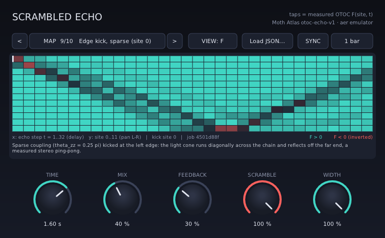
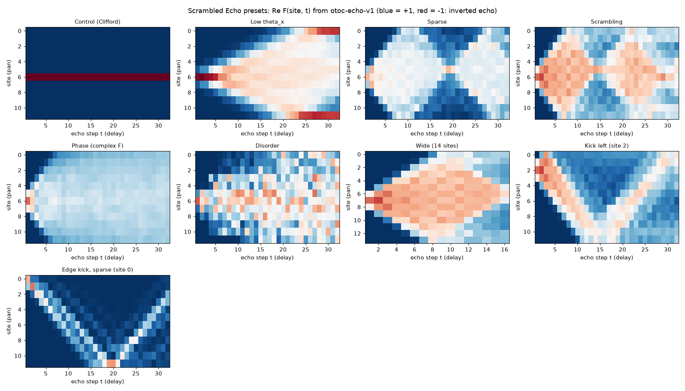
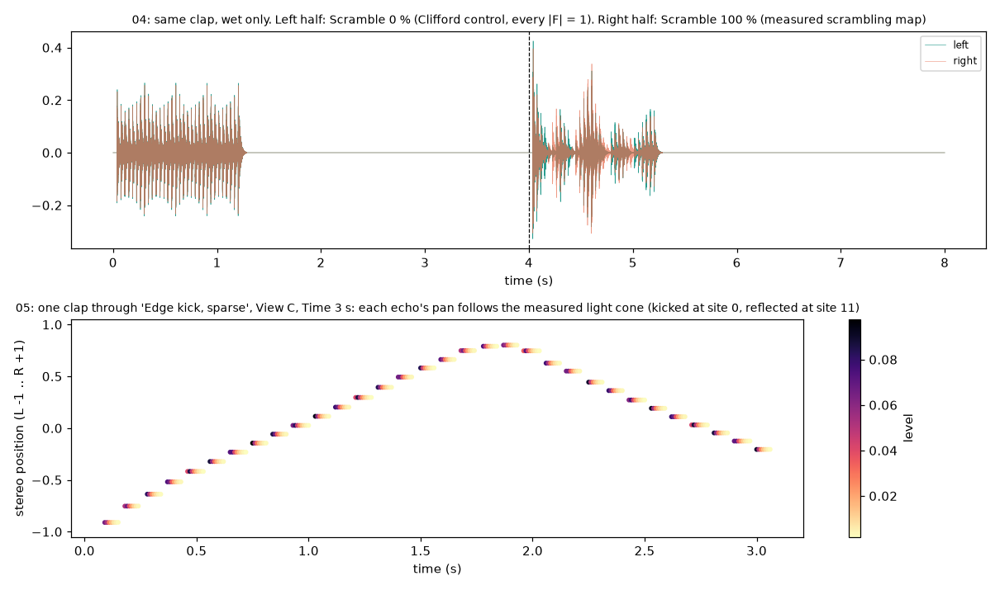

# Scrambled Echo (VST3, Windows x64)

A multi-tap delay whose echo pattern is a quantum measurement. Each tap is one cell of an
out-of-time-order correlator map **F(site, t)** measured on Moth Atlas with the `otoc-echo-v1` engine
(aer emulator, exact expectation values). The plugin plays that map back as echoes:

| map quantity | becomes |
|---|---|
| echo step `t = 1..depth` | delay `t / depth × Time` (`t = depth` lands exactly on Time) |
| `|F(site, t)|` | echo level |
| sign of `Re F` | polarity (`F < 0` = inverted echo) |
| `site / (n_sites - 1)` | constant-power stereo pan, left to right |
| whole map | wet signal normalised by `1 / sqrt(Σ gain²)` |



## Install

Copy the folder `dist/ScrambledEcho.vst3` (the whole bundle; also zipped as
`dist/ScrambledEcho-1.0.0-win64-vst3.zip`) into `C:\Program Files\Common Files\VST3\`,
then rescan plugins in your DAW. It is a stereo effect (category Fx | Delay). Everything is statically linked;
nothing else needs to be installed.

## Controls

| control | range | what it does |
|---|---|---|
| **Map** | 9 measured maps + Custom JSON | the selected OTOC map (see presets below). `<` / `>` or click the name to step |
| **Scramble** | 0–100 % | interpolates F cell by cell from the **Control (Clifford)** map at 0 % to the selected map at 100 % |
| **View** | F / C | **F**: gain = signed \|F\| (the echo that survives). **C**: gain = `(1 − Re F) / 2`, the normalised squared commutator, which is loud only where the kicked operator has spread: the light cone itself |
| **Time** | 50 ms – 8 s | length of the whole echo train. Smoothed, so sweeping it gives tape-style pitch bends rather than clicks |
| **Sync** + **Division** | 1/4, 1/2, 1 bar, 2 bars, 4 bars | locks the train length to host tempo (4/4). Falls back to 120 BPM if the host sends no tempo. With Sync on, the Time knob selects the division |
| **Mix** | 0–100 % | dry/wet |
| **Feedback** | 0–95 % | re-injects the final echo step (`t = depth`) so the whole train replays. Loop gain is normalised by that column's summed \|gain\|, so it can never exceed the knob value: maps whose last column is scrambled (mixed signs, small \|F\|) regenerate less, which is the physics, not a bug |
| **Width** | 0–100 % | scales the site → pan spread (0 % = mono) |
| **Load JSON…** | file | loads a custom map and selects Custom JSON |

The heatmap shows the map you are hearing, with the current Scramble and View applied (x = echo step / delay,
y = site / pan, white mark = kick site). Knobs: drag vertically (Shift = fine) or use the mouse wheel.

## Where the taps come from

`otoc-echo-v1` runs a kicked Floquet chain forward for `t` layers (RX(θx), RZZ(θzz), optional RZ(θz)), applies a
Pauli kick on one site, runs it backward, and returns `F(site, t)` for every site and every depth, plus a
flattened tap list in `extras.taps` (`site, depth, F_re, F_im, level, polarity`). `F = 1` means the kick has not
reached that site yet (the echo survives intact); inside the light cone F decays and flips sign as the operator
scrambles. The plugin embeds these numbers unchanged: `tools/export_presets.py` copies the measured grid into
`presets/*.json` and `src/Presets.hpp`.

All presets are 12-site chains, depth 32, `kick = Z`, `machine = aer`, `exact = true`, unless noted. Base
settings: θx = 0.3π, θzz = 0.35π, θz = 0, disorder 0, kick on the centre site (6).

| # | preset | change from base | otoc-echo-v1 job |
|---|---|---|---|
| 1 | Control (Clifford) | θzz = π (Clifford layer, no scrambling: every \|F\| = 1, kick site −1) | `89c7f269-9a0c-473a-936d-a0ac2a08aa77` |
| 2 | Low theta_x | θx = 0.1π | `6e5e76ef-0227-4f18-8b78-fadef0b48ae9` |
| 3 | Sparse | θzz = 0.25π | `253a55d0-2726-4503-8dfa-f5ad6f5c7418` |
| 4 | Scrambling (default) | base settings; finite-size revival around t ≈ 13–16 | `8df5cfa2-e57c-43a8-a93a-63975efd252c` |
| 5 | Phase (complex F) | θz = 0.25π | `7a4ccdfa-d29a-4e2b-a275-5dbb415a2dce` |
| 6 | Disorder | disorder 0.6 rad, seed 7 | `a3dbb646-05af-4f55-aef3-b497f609759d` |
| 7 | Wide (14 sites) | n_sites = 14, depth = 16 | `06a9801e-90ae-4e9d-a75b-4da42e128d21` |
| 8 | Kick left (site 2) | kick_site = 2 | `637f0daf-c4aa-4f4e-aaf4-13197c472111` |
| 9 | Edge kick, sparse (site 0) | kick_site = 0, θzz = 0.25π | `4501d88f-3666-48f6-b556-415d28595a5e` |



Off-centre kicks matter for stereo: a centre kick on a uniform chain gives a mirror-symmetric map, so the left
and right halves of each echo step carry nearly equal energy. Kicking at site 2 or site 0 breaks that symmetry
and the light cone becomes audible as motion across the stereo field (example 05 below).

Wider chains at depth 32 hit the engine's own response timeout on 2026-10-04 (n_sites/depth → job):
16/32 `0994f20d-5c09-4479-8a78-fd0d4ac009f1`, 24/32 `e4585c82-c100-4669-9301-d46d928296ee`,
14/32 `482f1c75-0e31-46c5-89dd-47c38d9290d1`, 16/16 `4c12d40b-fbb9-4144-b284-e139d30a31a2`. 14 sites at depth 16 worked.

### Custom maps

**Load JSON…** accepts:

- a bundled preset file from `presets/`;
- a raw `otoc-echo-v1` job result, or a cached `moth.run` record from `cache/otoc-echo-v1/*.json`
  (it finds `extras.taps`, `n_sites`, `depth`, `kick_site`, `job_id`);
- any JSON object with a `taps` array of `{site, depth|step, F_re, F_im}` or `{site, depth|step, level, polarity}`.

Grid size is taken from `n_sites` / `depth` when present, otherwise inferred from the taps. The path is stored in
the plugin state and reloaded with the session. The `retrocausal-echo-v1` engine can also return a tap map
(`emit: "map"`), but it was not responding during development, so that format is untested; it loads if its taps
use the keys above.

## Audio examples

Rendered **through the built plugin binary** (`dist/ScrambledEcho.vst3`, hosted by Spotify's pedalboard) by
`tools/render_examples.py`. Each pair shares one gain, so dry and wet levels compare honestly. Settings for each
file are in `examples/index.json`.

| file | input | what to listen for |
|---|---|---|
| `01_cooking_scramble_sweep` | 30 s of the recorded cooking stem | Scramble automated 0 → 100 → 0 %: the echo morphs from the Clifford control into the measured scrambling map and back |
| `02_drums_kick_left_C_sync` | synthesised 4-bar drum loop, 120 BPM | View C, Kick left, train synced to 1 bar: echoes appear where the operator has spread and drift left → right |
| `03_synth_edge_sparse_C` | synthesised plucked-saw arpeggio | View C on the edge-kicked sparse chain: a measured ping-pong that runs across the field and reflects |
| `04_clap_control_vs_scrambling` | two claps, wet only | first clap: Control (every \|F\| = 1, a uniform comb); second clap: measured scrambling map (gaps, inverted echoes, the t ≈ 13–16 revival) |
| `05_clap_light_cone_C` | one clap, wet only | View C, 3 s train: the echo's stereo position traces the light cone (plot below) |



## What is quantum and what is classical

- **Quantum (measured on Moth Atlas):** the F(site, t) maps, from `otoc-echo-v1` on the `aer` emulator with
  exact expectation values. Not QPU hardware.
- **Classical:** everything the plugin does with the numbers: delay lines, panning, normalisation, feedback,
  the Scramble interpolation (a linear blend of two measured maps, not a new measurement) and the C view (a
  fixed function of the measured F). For the Phase preset the plugin uses \|F\| and the sign of Re F; the
  complex phase itself is not rendered.
- The plugin does not call the API at runtime; maps are measured once and embedded.

## Build from source

Windows x64, no Visual Studio needed. The compiler is zig's bundled clang (pip package `ziglang`) targeting
`x86_64-windows-gnu`; the plugin framework is [DPF](https://github.com/DISTRHO/DPF) (ISC), fetched at a pinned
commit on first build.

```powershell
python -m venv .venv
.venv\Scripts\pip install -r plugin\requirements.txt
.venv\Scripts\python plugin\build.py          # runs the DSP core tests, then builds dist\ScrambledEcho.vst3
.venv\Scripts\python plugin\tests\test_vst3.py # loads the built plugin in a host and checks its impulse responses
```

Re-measuring the maps needs a Moth API key in `.env` (`MOTH_API_KEY`); runs are cached, so
`MODE=replay` rebuilds the presets offline from `cache/`:

```powershell
.venv\Scripts\python plugin\tools\measure.py          # otoc-echo-v1 runs -> plugin\tools\measured.json
.venv\Scripts\python plugin\tools\export_presets.py   # -> plugin\presets\*.json, src\Presets.hpp, maps.png
.venv\Scripts\python plugin\tools\render_examples.py  # audio examples through the built VST3
.venv\Scripts\python plugin\tools\screenshot_ui.py    # editor renders in docs\ (uses SE_UI_SNAPSHOT)
.venv\Scripts\python plugin\tools\plot_examples.py
```

### Layout

| path | contents |
|---|---|
| `src/ScrambledEchoCore.hpp` | the DSP: map compilation, fractional multi-tap delay, Scramble/View/Width gains, regenerating feedback. Framework-free |
| `src/MapJson.hpp` | JSON tap-map loader (presets, engine results, cached records) |
| `src/MapBank.hpp`, `src/Presets.hpp` | embedded presets (generated), sync divisions |
| `src/ScrambledEchoPlugin.cpp`, `src/ScrambledEchoUI.cpp` | DPF plugin and NanoVG editor |
| `tests/test_core.cpp` | 32 behaviour checks of the core and loader (hand-worked expected values), plus loading every preset and cached engine record from disk |
| `tests/test_vst3.py` | end-to-end checks of the built binary in a host |

## Tests

- `tests/test_core.cpp`: echoes land on the measured taps with the right gain, pan and polarity; Scramble
  interpolates F (F = +1 and −1 cancel at 50 %); Width 0 is mono; Mix 0 is dry; feedback replays only the
  `t = depth` step, stays bounded at maximum on a dense map and decays; Time sweeps, map swaps and Scramble moves
  are click-free; View C; JSON loader accepts engine records and presets and rejects garbage.
- `tests/test_vst3.py`: in pedalboard, the plugin's impulse response for every preset matches the preset JSON
  (F view, and C view for two maps; largest error in the last run 2e-7, threshold 2e-3); Scramble 0 % gives the
  Control map; Feedback 95 % decays; Sync 1/4 at 120 BPM puts the last echo at 0.500 s; Mix 0 % returns the
  input to within 1e-5.

## Limitations

- Windows x64 VST3 only (no AU, no macOS build). The editor is fixed-size (760 × 470).
- Tested hosts: pedalboard 0.9.25 only. Pedalboard on Windows will not scan the bundle folder itself; point it at
  the inner binary `dist/ScrambledEcho.vst3/Contents/x86_64-win/ScrambledEcho.vst3`. The bundle layout follows
  the VST3 spec for DAWs.
- Changing Map rebuilds the tap set on the thread that sets the parameter (a few hundred taps, a small
  allocation); the audio thread then swaps it in with a 20 ms crossfade.
- The Control end of Scramble is always the 12-site Clifford map. For maps with a different grid (Wide)
  the two maps' taps are blended as separate taps rather than cell by cell.
